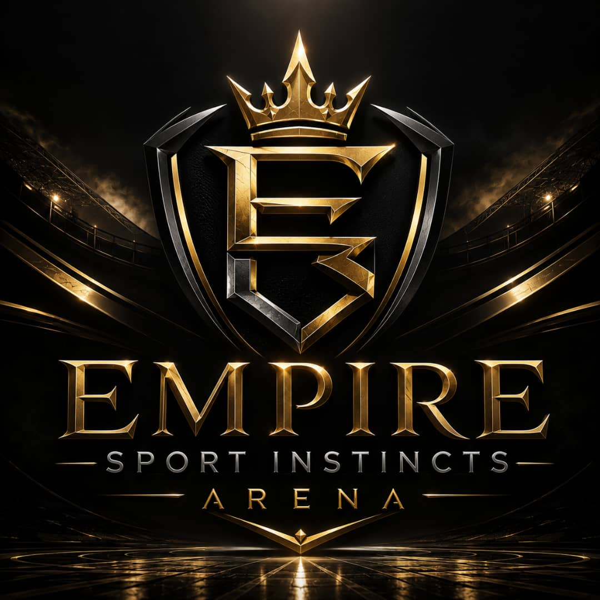
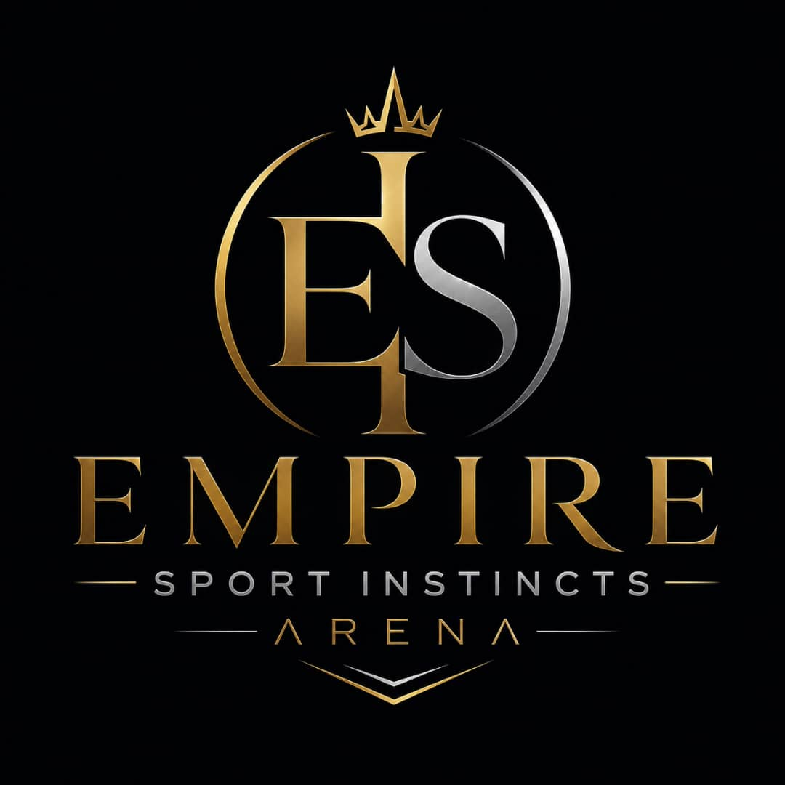

# EMPIRE SPORT INSTINCTS ARENA (ESIA)

<p align="center">
  
  <br><br>
  
</p>

---

## AI-Powered Sports Analytics & Prediction Intelligence Platform

### Vision

> **"Where Data Meets Instinct"** — A cutting-edge quantitative sports
> research engine that transforms raw athletic data into probabilistic
> intelligence. Built for the serious analyst who respects market
> efficiency while seeking analytical edges.

---

## System Architecture

```
╔══════════════════════════════════════════════════════════════════════════════╗
║                    EMPIRE SPORT INSTINCTS ARENA                            ║
║                         (ESIA v2.0.0)                                        ║
╠══════════════════════════════════════════════════════════════════════════════╣
║  ┌───────────────┐    ┌───────────────┐    ┌──────────────────────────┐   ║
║  │  INSTINCT     │───▶│   ARENA       │───▶│      EMPIRE CORE         │   ║
║  │   SCOUT       │    │  FORGE        │    │   (Ensemble Intelligence)│   ║
║  │Data Ingestion │    │Feature Eng.   │    │  XGBoost + Transformers  │   ║
║  └───────────────┘    └───────────────┘    │    + Bayesian Nets       │   ║
║                                            └──────────┬─────────────────┘   ║
║                                                       │                      ║
║  ┌───────────────┐    ┌───────────────┐    ┌─────────▼─────────────────┐   ║
║  │   ARENA       │◀───│  COMMAND      │◀───│      INSTINCT ENGINE    │   ║
║  │  DASHBOARD    │    │  CENTER       │    │   (Value Detection + EV)│   ║
║  │  (Real-time)  │    │  (Risk Mgmt)  │    │   Probability Calibration│   ║
║  └───────────────┘    └───────────────┘    └─────────────────────────┘   ║
╚══════════════════════════════════════════════════════════════════════════════╝
```

---

## Core Modules

| Module | Codename | Function |
|--------|----------|----------|
| **Data Ingestion** | `INSTINCT SCOUT` | Auto-discovers matches across all sports |
| **Feature Engineering** | `ARENA FORGE` | Forges 50+ predictive features per sport |
| **Model Ensemble** | `EMPIRE CORE` | XGBoost + Temporal Transformers + Bayesian Networks |
| **Value Detection** | `INSTINCT ENGINE` | EV calculation with uncertainty quantification |
| **Risk Management** | `COMMAND CENTER` | Kelly Criterion + Drawdown Protection |
| **Visualization** | `ARENA DASHBOARD` | Real-time web interface |

---

## Supported Sports & Leagues

- ⚽ **FOOTBALL:** Premier League, La Liga, Bundesliga, Serie A, Ligue 1, Champions League
- 🏀 **NBA:** Full Season + Playoffs + Summer League
- 🏈 **NFL:** Regular Season + Playoffs + Super Bowl
- 🎾 **TENNIS:** ATP Tour, WTA Tour, Grand Slams, Davis Cup

---

## Performance Philosophy

> *"The market is efficient, but not perfectly efficient. Our edge is
> microscopic — 2-5% — but compounded with discipline, it becomes
> significant."*

**Realistic Targets:**
- Win Rate vs Spread: **52-57%** (anything above 52.4% beats the vig)
- Edge Detection: **2-5% EV** opportunities
- Sharpe Ratio: **0.8-1.2** (paper trading)
- Max Drawdown: **<20%** with proper Kelly sizing

---

## Data Sources (Free/Open Tier)

| Sport | Primary Source | Secondary Source |
|-------|---------------|------------------|
| Football | StatsBomb Open Data | Understat (xG), Football-Data.co.uk |
| NBA | nba_api (Python) | Basketball-Reference |
| NFL | nflfastR (R/Python) | Pro-Football-Reference |
| Tennis | Jeff Sackmann GitHub | ATP/WTA Official |
| Odds | The Odds API (500/mo free) | SharpAPI (12 req/min free) |

---

## Installation & Launch

```bash
# Clone and setup
cd EMPIRE_SPORT_INSTINCTS_ARENA
pip install -r requirements.txt

# Initialize infrastructure
docker-compose up -d postgres redis

# Start the Empire
python -m data_ingestion.scheduler    # Launch INSTINCT SCOUT
python -m dashboard.app               # Launch ARENA DASHBOARD
```

---

## Risk Management Rules

1. **Quarter Kelly Sizing:** Never risk more than 25% of full Kelly
2. **Max Bet Cap:** 3% of bankroll per position (regardless of edge)
3. **Sport Diversification:** Max 40% exposure to single sport
4. **Drawdown Circuit Breaker:** Pause at 20% drawdown, 7-day cooldown
5. **Daily Limit:** Maximum 10 bets per day

---

## Disclaimer

**This system is for EDUCATIONAL AND RESEARCH PURPOSES ONLY.**

- No guaranteed profits. Sports markets contain significant randomness.
- Past performance does not predict future results.
- Always comply with local laws regarding sports analytics and wagering.
- The "Instinct" in our name refers to algorithmic pattern recognition, not gambling intuition.

---

## License

MIT License — Empire Sport Instincts Arena © 2026

---

<p align="center">
  <sub>Dark Gold Premium Edition v2.0 | Production Ready</sub>
</p>
